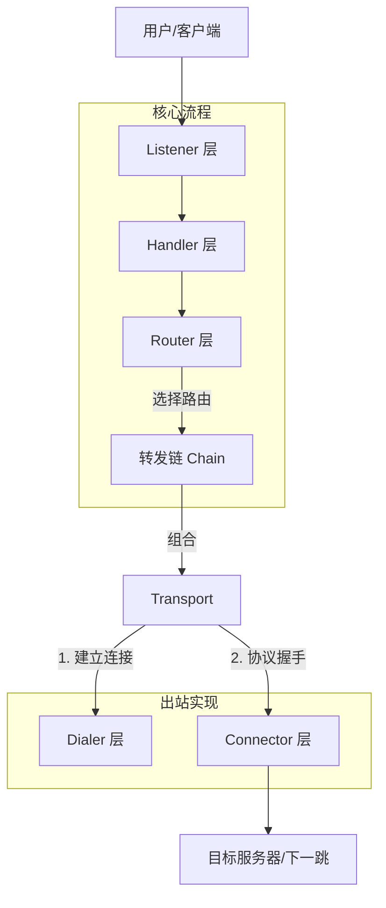

# Go Forward 设计文档

> 一个安全、轻量级、高性能的端口转发和代理工具

---

## 目录

- [项目概述](#项目概述)
- [架构设计](#架构设计)
- [核心模块](#核心模块)
- [支持的协议](#支持的协议)
- [详细使用方式](#详细使用方式)
- [配置文件](#配置文件)
- [路由规则](#路由规则)
- [扩展开发](#扩展开发)

---

## 项目概述

### 核心功能

| 功能           | 描述                                     |
| -------------- | ---------------------------------------- |
| **端口转发**   | TCP/UDP 端口转发，支持灵活的转发链配置   |
| **代理服务器** | HTTP/SOCKS5/TLS/HTTP3 代理协议           |
| **内网穿透**   | 支持反向代理，将内网服务安全暴露到公网   |
| **智能路由**   | 基于域名、IP、GeoIP 的精细化流量分流规则 |
| **安全强化**   | 默认启用 TLS 验证，支持多种加密传输方式  |

### 设计哲学

1.  **职责分离 (Separation of Concerns)**:
    *   **Dialer (传输层)**: 负责建立物理连接 (TCP, TLS, QUIC, etc.)。
    *   **Connector (连接层)**: 负责协议握手和隧道建立 (HTTP Connect, SOCKS5 Handshake)。
    *   此设计使得协议与传输方式解耦，实现了如 "SOCKS5 over TLS" 或 "HTTP over QUIC" 的灵活组合。
2.  **接口优先**: 所有核心组件（Listener, Handler, Dialer, Connector）均通过接口定义，便于扩展和测试。
3.  **链式架构**: 通过 `chain` 包统一管理转发节点，支持无限级联的代理链。
4.  **配置驱动**: 支持命令行参数、JSON 配置文件、INI 路由规则三种配置方式，满足不同场景需求。

---

## 架构设计

### 整体架构



### 分层架构体系

```text
Layer 1: 入口与配置 (Entry & Config)
    ├── cmd/forward/          # 程序入口
    ├── base/app/             # 应用生命周期管理
    └── internal/config/      # 配置解析 (INI/JSON/Flags)

Layer 2: 服务监听 (Service Layer)
    ├── internal/service/     # 服务编排 (Listener + Handler)
    ├── internal/listener/    # 入站连接监听 (TCP, HTTP, QUIC...)
    └── internal/handler/     # 入站协议处理 (HTTP, SOCKS5, Reverse...)

Layer 3: 路由决策 (Routing Layer)
    ├── internal/router/      # 路由管理器
    ├── base/route/           # 路由规则库
    └── internal/chain/       # 转发链管理

Layer 4: 出站连接 (Outbound Layer)
    ├── internal/chain/       # Transport 封装
    ├── internal/dialer/      # 传输层拨号 (TCP, TLS, QUIC)
    └── internal/connector/   # 协议层连接 (HTTP Connect, SOCKS5)

Layer 5: 基础设施 (Infrastructure)
    ├── base/logging/         # 日志系统
    ├── base/auth/            # 认证管理
    ├── base/endpoint/        # 端点解析
    └── base/pool/            # 缓冲池优化
```

---

## 核心模块

### 1. Dialer (传输层拨号器)

**定位**：负责底层的网络连接建立。不关心传输的具体内容，只负责 "连通"。

**接口定义**：
```go
type Dialer interface {
    Init(metadata.Metadata) error
    Dial(ctx context.Context, addr string, opts ...DialOption) (net.Conn, error)
}
```

**主要实现**：
*   `tcp`: 基础 TCP 连接。
*   `tls`: 在 TCP 之上封装 TLS 握手。
*   `quic`: 建立 QUIC 连接（基于 UDP）。

### 2. Connector (协议层连接器)

**定位**：在已建立的连接（由 Dialer 提供）之上，执行特定协议的握手或隧道建立操作。

**接口定义**：
```go
type Connector interface {
    Init(metadata.Metadata) error
    Connect(ctx context.Context, conn net.Conn, network, address string, opts ...ConnectOption) (net.Conn, error)
}
```

**主要实现**：
*   `http`: 发送 HTTP CONNECT 请求建立隧道。
*   `socks5`: 执行 SOCKS5 握手和命令交互。
*   `forward`: 简单的直接转发（无握手）。

### 3. Transport (传输组合)

**定位**：`internal/chain` 包中的核心概念，将 `Dialer` 和 `Connector` 组合成一个完整的出站能力。

*   每个转发节点（Node/Hop）都由一个 `Transport` 实例表示。
*   代理链本质上是一组有序的 `Transport`。

### 4. Handler (入站处理器)

**定位**：处理客户端的入站请求，解析协议，并根据请求目标通过 Router 转发流量。

**主要实现**：
*   `http`: 处理 HTTP 代理请求（支持 plain HTTP 和 CONNECT）。
*   `socks5`: 处理 SOCKS5 请求（Connect, Bind, UDP Associate）。
*   `tcp/udp`: 纯粹的端口转发处理。

---

## 支持的协议

| 协议           | Listener (入站) | Dialer (传输) | Connector (出站握手) | 说明                    |
| :------------- | :-------------: | :-----------: | :------------------: | :---------------------- |
| **TCP**        |        ✅        |       ✅       |          -           | 基础传输                |
| **HTTP**       |        ✅        |       -       |          ✅           | HTTP 代理 / 隧道        |
| **HTTPS**      |        ✅        |       -       |          ✅           | HTTP over TLS           |
| **SOCKS5**     |        ✅        |       -       |          ✅           | 标准 SOCKS5             |
| **TLS**        |        -        |       ✅       |          -           | 安全传输层              |
| **QUIC**       |        -        |       ✅       |          -           | HTTP/3 底层传输         |
| **SOCKS5H**    |        ✅        |       -       |          -           | SOCKS5 (服务端解析域名) |
| **SOCKS5+TLS** |        -        |       -       |       ✅ (组合)       | 隐蔽性更强              |

---

## 详细使用方式

### 1. 命令行快速模式

**简单转发**
```bash
# 将本地 8080 端口转发到 1.2.3.4:80
forward -L tcp://:8080/1.2.3.4:80
```

**启动代理服务器**
```bash
# 启动 HTTP 和 SOCKS5 混合代理
forward -L http://:8080 -L socks5://:1080
```

**使用代理链**
```bash
# 本地 -> 代理A -> 代理B -> 目标
forward -L tcp://:8080/target:80 -F socks5://proxyA:1080 -F http://proxyB:8080
```

### 2. 配置文件模式

推荐使用 JSON 配置文件管理复杂配置。

**config.json 示例**：
```json
{
  "nodes": [
    {
      "name": "main_proxy",
      "listen": "socks5://:1080",
      "forward_chain": [
        "socks5://10.0.0.1:1080",
        "tls://proxy.example.com:443"
      ]
    },
    {
      "name": "web_tunnel",
      "listen": "http://:8080"
    }
  ],
  "route": {
    "proxies": {
      "US_NODE": "socks5://us.example.com:1080"
    }
  }
}
```

---

## 路由规则

支持基于域名的精细化路由控制。使用 `-R route.ini` 加载。

### 规则语法
```ini
[General]
listen = socks5://:7890

[Proxy]
MyVPS = vless://uuid@host:443?security=reality...

[Rule]
# 语法: 类型, 匹配值, 动作
DOMAIN-SUFFIX, google.com, MyVPS
DOMAIN-KEYWORD, twitter, MyVPS
GEOIP, CN, DIRECT
FINAL, MyVPS
```

*   **DIRECT**: 直连
*   **REJECT**: 拒绝连接
*   **ProxyName**: 转发到 [Proxy] 段定义的节点

---

## 扩展开发

### 添加新协议支持

得益于 Dialer/Connector 分离架构，添加新协议非常简便：

**场景 1：添加新的传输协议 (如 WebSocket)**
1.  在 `internal/dialer/websocket` 实现 `Dialer` 接口。
2.  在 `dialer.Register` 中注册 `ws` 协议。
3.  即使没有对应的 Connector，也可以配合现有的 HTTP/SOCKS5 Connector 使用（例如 SOCKS5 over WebSocket）。

**场景 2：添加新的代理协议 (如 Shadowsocks)**
1.  在 `internal/connector/shadowsocks` 实现 `Connector` 接口。
2.  在 `connector.Register` 中注册 `ss` 协议。
3.  它可以运行在任何 Dialer (TCP, TLS, WebSocket) 之上。

### 源码编译

```bash
# 或者是 make build
go build -o forward cmd/forward/main.go
```
